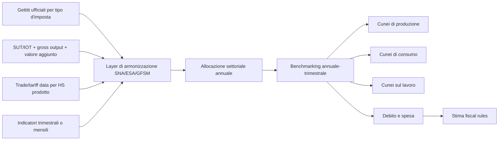
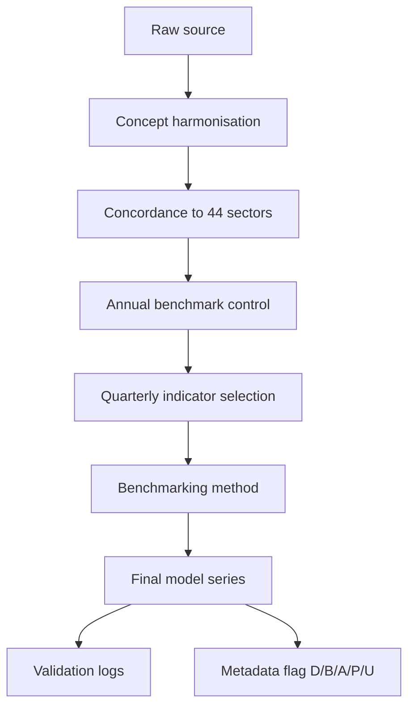

# Ricostruzione dei cunei fiscali da serie di gettito per un DSGE-IO multi-paese e multi-settore

## Sintesi esecutiva

La risposta breve è che **sì, la ricostruzione è fattibile**, ma solo se viene impostata come un sistema gerarchico di misura e non come una semplice ripartizione meccanica del gettito. Per un modello DSGE/input-output a 44 settori con blocchi Stati Uniti, area euro, Cina e resto del mondo, la strategia più solida è una **architettura ibrida top-down / bottom-up**: si prendono i **gettiti ufficiali per tipo d’imposta** come vincoli aggregati; si prendono **SUT/IOT, gross output, valore aggiunto, basi salari e matrici d’uso** come basi allocative; si separano rigorosamente **imposte sui prodotti** da **altre imposte sulla produzione** e **sussidi ai prodotti** da **altri sussidi alla produzione**; infine si porta tutto a frequenza trimestrale con benchmarking/temporal disaggregation. Questa impostazione è coerente con la logica contabile SNA/ESA/GFSM e con una stima di fiscal rules in stile Leeper‑Plante‑Traum, che richiede serie fiscali aggregate coerenti nel tempo e nello spazio, ma che non impone che ogni singola grandezza settoriale sia osservata direttamente. citeturn26view0turn5view0turn15view1turn6view0turn6view1

La prima raccomandazione è di distinguere **tre livelli di qualità informativa**. Il livello migliore è il **dato ufficiale diretto**: ad esempio, per gli Stati Uniti, i conti input-output e industry accounts del BEA consentono di costruire direttamente uno scheletro annuale settoriale di produzione e basi denominatrici; per l’area euro, Eurostat fornisce sia i conti fiscali trimestrali di governo generale sia i tavoli ESA supply-use/input-output; per la Cina, il Ministero delle Finanze e l’NBS forniscono serie ufficiali di gettito e attività, ma molto meno dettaglio fiscale settoriale diretto. Il secondo livello è il **dato ufficiale indiretto**: serie di gettito per tipo d’imposta, output settoriale, import per prodotto, basi imponibili salariali, spesa pubblica per funzione. Il terzo livello è il **dato armonizzato o modellato**: OECD Revenue Statistics, UNSD SNA tables, OECD ICIO, GTAP, Eora, EXIOBASE. Questo terzo livello è utile come prior, benchmark, checksum, o strumento di allocazione; non dovrebbe però essere presentato come misura diretta di fiscal receipts settoriali. citeturn34search1turn34search3turn5view8turn27search11turn32view0turn33view0turn8view2turn6view3turn7view3turn8view1turn7view6turn8view0

Per il **production wedge**, la regola operativa consigliata è: usare come target il concetto SNA/ESA di **other taxes on production minus other subsidies on production**, cioè D.29 meno D.39, e **tenere fuori** D.21, D.31, dazi e import-VAT, salvo che il tuo modello richieda un cuneo ai prezzi d’acquisto o all’import. Questo punto è centrale: la tabella SNA 2.6 dell’UNSD distingue espressamente tra “Taxes on products”, “Other taxes on production”, “Subsidies on products” e “Other subsidies on production”; Eurostat, nel dataset trimestrale del governo generale, pubblica in parallelo D.2, D.21, D.211, D.29, D.31 e D.39. Perciò la ricostruzione non deve “mescolare” gettiti di IVA, accise e dazi con il cuneo di produzione, se non come oggetto separato. citeturn26view0turn5view0turn5view1

Per il **consumption wedge**, il punto chiave non è solo osservare l’IVA o le sales taxes, ma separare almeno quattro blocchi: **IVA/sales tax domestica**, **accise**, **IVA e imposte sul consumo all’import**, **dazi/import duties**. La Cina è un caso particolarmente istruttivo perché il MOF distingue esplicitamente Domestic VAT, Domestic Consumption Taxes, VAT and Consumption Taxes on Imports of Goods, Customs Duties e VAT/Consumption Tax Rebates on Exports of Goods, cioè i rimborsi/rebate all’export che alterano radicalmente la lettura delle serie di gettito se si lavora solo “net of refunds”. Questo implica che, in un sistema receipts-based, i rimborsi IVA e le export rebates devono essere trattati come componente separata della tassazione sui prodotti, non come “rumore” statistico. Più in generale, il GFSM tratta il gettito fiscale **al netto dei refunds**, e questo va esplicitato nelle note di misura. citeturn18view3turn18view2turn28search20turn28search5

Per il **labour wedge**, la ricostruzione più difendibile è basata su **personal income taxes imputabili al lavoro + contributi sociali dei datori + contributi sociali dei lavoratori + payroll taxes**, divisi per **compensation of employees** o per wage bill settoriale. Tuttavia, le serie di gettito non identificano automaticamente la quota di PIT riferibile ai redditi da lavoro rispetto a redditi da capitale e misti. Perciò la raccomandazione è di usare le serie fiscali ufficiali come controllo aggregato e di imporre un **coefficiente di imputazione wage‑share del PIT** calibrato su fonti dedicate o su benchmark esterni come OECD Taxing Wages, che misura il tax wedge sul lavoro come somma di imposta sul reddito personale, contributi di datore e lavoratore e payroll taxes, meno benefits, in rapporto al costo del lavoro. Il benchmark OECD è utile per il livello medio del cuneo, ma non può sostituire le basi fiscali/macro settoriali del modello. citeturn14view3turn9search12turn5view1

Per **debito e spesa**, la strategia corretta è scegliere **un solo concetto stock-flusso per blocco**, esplicitarlo e non mischiarlo. Per l’UE, Eurostat `gov_10q_ggdebt` misura il debito lordo nominale del governo generale al face value, in definizione Maastricht. Per gli Stati Uniti, il dataset Treasury “Debt to the Penny” distingue nettamente tra **Debt Held by the Public**, **Intragovernmental Holdings** e **Total Public Debt Outstanding**; queste grandezze non coincidono con il debito di governo generale ESA/GFS e non sono intercambiabili. Per la Cina e il ROW, il candidato più robusto per comparabilità internazionale è QPSD, se la copertura del paese esiste e la definizione è quella di **gross general government debt**; in alternativa, va dichiarato che si sta usando un concetto diverso. citeturn5view3turn5view4turn12view1turn6view2

Il cuore operativo del sistema, soprattutto per i blocchi non-U.S., è il seguente:

Sul piano pratico, la **migliore strategia immediata** è molto chiara.  
Per gli **Stati Uniti**, si può già arrivare a una calibrazione molto forte usando BEA I-O/SUT per lo scheletro annuo settoriale, BEA gross output/GDP by industry come denominatori, NIPA/FRED/Treasury per il controllo trimestrale aggregato, e Census soltanto come arricchimento per state/local taxes o per pesi di business taxes. Per l’**area euro/UE**, si può fare un salto di qualità sostanziale integrando Eurostat `gov_10q_ggnfa`, `gov_10a_taxag`, `gov_10q_ggdebt`, `gov_10a_exp`, ESA SUT/IOT e `env_ac_taxind2`. Per la **Cina**, si può migliorare molto l’aggregato e discretamente il settoriale, ma occorre accettare che la maggior parte delle allocazioni a 44 settori resterà **stimata** e non **osservata**: MOF per il gettito di tipo-imposta, NBS per i denominatori e l’output trimestrale, WTO/WITS per i dazi e la separazione import-related/product taxes, e un sistema di pesi policy-based per ripartire le imposte non direttamente osservate per attività. Per il **ROW**, la soluzione difendibile è: IMF GFS/QGFS/QPSD e UNSD SNA come backbone ufficiale, OECD GRS per il dettaglio di struttura del gettito, e MRIO globali solo come prior di allocazione settoriale. citeturn34search3turn34search0turn22search0turn11search0turn13view0turn5view0turn5view8turn5view3turn5view7turn5view5turn5view6turn32view0turn33view0turn18view3turn17view1turn20view0turn21view3turn6view0turn6view1turn6view2turn6view3turn8view2

Infine, in ottica referee, la linea più difendibile in un paper è dichiarare esplicitamente che il sistema produce **receipt-based effective wedges**, non misure pure di incidenza economica. Le serie di gettito osservano ciò che il governo incassa, e solo alcune basi statistiche – ad esempio le environmental taxes by economic activity di Eurostat – localizzano il **payer** per attività economica; questo non equivale ancora all’incidenza generale dell’imposta. Se questa distinzione viene spiegata bene, se la separazione prodotto/produzione è pulita, se le regole di benchmarking sono standard e se le proxy per Cina/ROW sono chiaramente ordinate per qualità, la costruzione è metodologicamente forte. Le principali vulnerabilità da ammettere sono: allocazione settoriale in Cina/ROW, trattamento di rimborsi e rebates, differenze tra concetti di debito, e uso di MRIO come prior e non come osservazione fiscale. citeturn5view5turn5view6turn12view1turn33view0turn7view3turn7view6turn8view0

## Tabella ragionata delle fonti

| Dataset / famiglia | Link diretto | Copertura | Tempo / frequenza | Dettaglio settoriale | Variabili utili | Unità / classificazione | Accesso | Uso nel modello | Mapping principale | Limiti principali | Priorità | Verifica |
|---|---|---|---|---|---|---|---|---|---|---|---|---|
| **BEA Input‑Output / Supply‑Use Accounts** | `https://www.bea.gov/data/industries/input-output-accounts-data` | USA | annuale; benchmark quinquennale circa | 71 industrie annuali; 402 benchmark | supply, use, make-use-import, requirements; denominatori GO/inputs | BEA I‑O / NAICS concordabile | pubblico | scheletro annuo settoriale per cunei di produzione e basi imponibili | production wedge, denominatori, mapping 44 settori | annuale; solo USA | **Essenziale** | citeturn34search3turn30search5turn34search18 |
| **BEA Gross Output by Industry** | `https://www.bea.gov/data/industries/gross-output-by-industry` | USA | trimestrale e annuale | industrie BEA | gross output, reale e nominale | conti industria BEA | pubblico | denominatore trimestrale per production wedge | production wedge denominator | dettaglio inferiore al benchmark I‑O | **Essenziale** | citeturn34search0 |
| **BEA GDP by Industry / Industry Economic Accounts** | `https://www.bea.gov/data/gdp/gdp-industry` ; `https://www.bea.gov/data/economic-accounts/industry` | USA | annuale e trimestrale | industry accounts | value added, compensation, gross operating surplus, taxes | BEA / NAICS | pubblico | wage base, VA base, coerenza con IO | labour wedge denominator; controllo production wedge | alcune tavole non sono direttamente fiscali | **Essenziale** | citeturn34search1turn34search2 |
| **BEA NIPA / iTable e FRED mirror** | `https://www.bea.gov/itable` ; `https://www.bea.gov/data/gdp/gross-domestic-product` ; `https://fred.stlouisfed.org/series/W254RC1Q027SBEA` | USA | trimestrale e annuale | aggregato | taxes on production and imports, subsidies, government receipts/expenditures | NIPA / BEA; FRED riporta serie BEA | pubblico | controllo aggregato trimestrale e vintage tracking; non source-of-truth finale | production wedge aggregate; fiscal rule estimation | FRED è mirror secondario; non sostituisce la fonte BEA | **Essenziale** | citeturn35view1turn22search0turn22search4 |
| **U.S. Treasury Fiscal Data: Monthly Treasury Statement + Debt to the Penny** | `https://fiscaldata.treasury.gov/datasets/monthly-treasury-statement/` ; `https://fiscaldata.treasury.gov/datasets/debt-to-the-penny/` | USA federale | mensile / giornaliero | nessun dettaglio settoriale | receipts, outlays, deficit; debt held by public, intragovernmental, TPDO | dollari correnti | pubblico/API | alta frequenza per reaction functions; distinzione concetti di debito | debt block; fiscal rule estimation | concetto federale, non government general ESA/GFS | **Essenziale** | citeturn11search0turn12view1 |
| **U.S. Census QTAX / STC / ASFIN-ALFIN** | `https://www.census.gov/programs-surveys/qtax.html` ; `https://www.census.gov/programs-surveys/stc.html` ; `https://www.census.gov/programs-surveys/gov-finances.html` | USA state/local | trimestrale e annuale | per stato; non per industria | sales taxes, excises, tax subcategories; revenue, expenditure, debt, assets state/local | classificazioni survey Census | pubblico | integra federal layer per consolidare il settore pubblico USA | consumption wedge, debt/spending, fiscal rules | non settoriale industriale; classificazioni non SNA/ESA | **Utile** | citeturn13view0turn12view3turn27search0turn27search12 |
| **U.S. Census AIES / Economic Census fields** | `https://www.census.gov/programs-surveys/aies/about.html` | USA business | annuale | NAICS; impresa/settore | taxes and license fees, payroll, revenues, expenses | NAICS | pubblico ma di natura survey | solo come peso allocativo per business/property taxes o other taxes on production | production wedge weights; labour bases | esclude sales, excise e income taxes; non è gettito fiscale | **Opzionale** | citeturn13view1turn25search1turn25search14 |
| **Eurostat gov_10q_ggnfa** | `https://ec.europa.eu/eurostat/databrowser/product/page/gov_10q_ggnfa` | UE, area euro, stati membri, EFTA | trimestrale | istituzionale, non industriale | D.2, D.21, D.211, D.29, D.31, D.39, D.5, D.61, spesa e redditi di governo | ESA 2010 | pubblico | backbone trimestrale per cunei fiscali aggregati e reaction functions | production, consumption, labour, spending, rules | non settoriale per industria | **Essenziale** | citeturn5view0turn5view1turn5view2 |
| **Eurostat gov_10a_taxag / gov_10a_exp / gov_10q_ggdebt** | `https://ec.europa.eu/eurostat/databrowser/product/page/gov_10a_taxag` ; `https://ec.europa.eu/eurostat/databrowser/product/page/gov_10a_exp` ; `https://ec.europa.eu/eurostat/databrowser/product/page/gov_10q_ggdebt` | UE, area euro, stati membri | annuale / trimestrale | istituzionale e COFOG | detailed tax and social contributions receipts; expenditure by function; gross debt Maastricht | ESA 2010 / COFOG / Maastricht debt | pubblico | dettaglio annuo tasse+SSC, spesa per funzione, debito stock | labour wedge; spending allocations; debt block; rules | annuale per taxag/exp; non industriale | **Essenziale** | citeturn5view8turn5view9turn5view7turn5view3turn5view4 |
| **Eurostat env_ac_taxind2** | `https://ec.europa.eu/eurostat/databrowser/product/page/ENV_AC_TAXIND2` | UE paesi | annuale | per NACE Rev.2, households, non‑residents | environmental taxes by economic activity | MNAC; NACE Rev.2 | pubblico | eccellente splitter ufficiale per energy/environmental taxes e parte di excises produttive | production wedge allocation; consumption vs producer split | copre solo environmental taxes, non tutto il sistema fiscale | **Essenziale** | citeturn5view5turn5view6 |
| **Eurostat ESA SUT/IOT e FIGARO** | `https://ec.europa.eu/eurostat/web/esa-supply-use-input-tables/database` | UE / EU IC-SUIOT | annuale | 64 industrie NACE, 64 prodotti CPA (FIGARO) | supply, use, IOT, global network structure | NACE Rev.2 / CPA 2.1 / ESA 2010 | pubblico | denominatori, mapping prodotto‑industria, proxy ROW, trade use matrices | production wedge denominators; consumption mapping; ROW structure | annuale; fiscalità non diretta | **Essenziale** | citeturn5view10turn27search11turn27search8turn27search5 |
| **IMF GFS_SOO / QGFS / QPSD** | `https://data.imf.org/en/datasets/IMF.STA:GFS_SOO` ; `https://data.imf.org/en/datasets/IMF.STA:QGFS` ; `https://www.worldbank.org/en/programs/debt-statistics/qpsd` | molti paesi, inclusi ROW | annuale / trimestrale | istituzionale | revenue, expenditure, balance, financing, balance sheet, gross debt | GFSM / public sector debt stats | pubblico/API, copertura variabile | backbone cross-country per fiscal rules, debt, aggregati fiscali comparabili | debt, spending, labour, consumption, reaction functions | copertura e dettaglio per paese eterogenei; non settoriale industriale | **Essenziale** | citeturn6view0turn6view1turn6view2 |
| **UNSD SNA Table 2.6 e 4.1** | `https://data.un.org/Data.aspx?d=SNA&f=group_code:206` ; `https://data.un.org/Data.aspx?d=SNA&f=group_code:401` | 100+ paesi | annuale | industry / total economy | output, GVA, taxes on products, other taxes on production, subsidies on products, other subsidies on production | SNA 2008 / ISIC Rev.4 | pubblico/API download | fonte armonizzata per paesi extra‑UE e denominatori settoriali ufficiali | production wedge annuale; denominatori; ROW backbone | annuale; copertura per paese irregolare | **Essenziale** | citeturn6view3turn26view0turn26view2turn26view3turn26view4 |
| **OECD Global Revenue Statistics Database** | `https://www.oecd.org/en/data/datasets/global-revenue-statistics-database.html` | 141 economie | annuale dal 1990 | non settoriale | 63 tax types, general/subnational/social security levels | classificazione OECD delle imposte | pubblico | ottimo benchmark cross-country di struttura del gettito per tipo d’imposta | consumption, labour, aggregate production tax shares | non settoriale; annuale | **Essenziale** | citeturn8view2turn7view0 |
| **OECD Taxing Wages** | `https://www.oecd.org/en/publications/taxing-wages-2026_3a5169ef-en/full-report.html` | paesi OECD | annuale | nessun dettaglio settoriale | tax wedge su lavoro, PIT, SSC employee/employer, payroll taxes | labor cost framework OECD | pubblico | benchmark esterno per il blocco labour wedge e sanity checks | labour wedge validation | non è una serie di gettito né un dato settoriale | **Utile** | citeturn14view3turn9search12 |
| **AMECO** | `https://economy-finance.ec.europa.eu/economic-research-and-databases/economic-databases/ameco-database_en` | UE, area euro, paesi OECD | annuale | macro | dati macro-fiscali annuali, output gap, aggregates DG ECFIN | macro annual database | pubblico | utile per regole fiscali annuali, output gap e controlli di policy | fiscal rule estimation | annuale soltanto | **Utile** | citeturn27search1turn27search13 |
| **MOF Cina: General Government Operations** | `https://www.mof.gov.cn/en/data/202309/t20230915_3907533.htm` | Cina | annuale | governo generale, non industriale | revenue, expenditure, balance, financing; consolidazione di quattro budget | SDDS / GFSM-like, miliardi RMB | pubblico | miglior fonte ufficiale aggregata per rules, deficit, financing e consolidazione | debt/spending/rules | annuale; niente settore industriale; financing non include rimborsi principal debt | **Essenziale** | citeturn33view0 |
| **MOF Cina: Budgeted Revenue by tax type** | `https://www.mof.gov.cn/en/data/202011/t20201126_3630685.htm` | Cina | annuale | nessun dettaglio settoriale | Domestic VAT, Consumption Tax, import VAT/consumption taxes, customs duties, export rebates, resource tax, stamp duty, vehicle purchase tax ecc. | 100 million RMB | pubblico | chiave per separare produzione/prodotti/importazioni/rimborsi nelle ricostruzioni cinesi | production vs consumption vs tariff wedges | pagina esemplificativa e non lunga time series pronta all’uso; occorre scraping/manual build | **Essenziale** | citeturn18view0turn18view1turn18view2turn18view3 |
| **NBS Cina: Quarterly GDP by industry + Yearbook / I‑O** | `https://www.stats.gov.cn/english/PressRelease/202604/t20260420_1963362.html` ; `https://www.stats.gov.cn/sj/ndsj/2025/indexeh.htm` | Cina | trimestrale / annuale | trimestrale: 11 industry groups; annuo I‑O: più dettagliato | GDP per settore, classificazione GB/T 4754‑2017; yearbook con tavole I‑O 2023 | RMB; classificazione nazionale cinese | pubblico | denominatori e indicatori trimestrali; base per mapping Cina→44 settori | denominatori production/labour/spending | dettaglio settoriale fiscale diretto assente; **yearbook verificato solo indirettamente in questa sessione** | **Essenziale** | citeturn17view1turn19search0 |
| **WTO Tariff & Trade Data / WITS** | `https://ttd.wto.org/en` ; `https://wits.worldbank.org/` | globale | annuale, con alcuni aggiornamenti più frequenti | prodotto HS / tariff line | bound/appplied tariffs, import data, indicatori tariffari, HS concordance tables | HS, IDB/CTS, HS6 | pubblico; alcune funzioni richiedono login | separazione dazi/import VAT e mapping HS→settori modello | tariff wedge; esclusione componenti import dalla production tax | WITS/TTD non danno da soli incassi fiscali di cassa; servono insieme a import values e duty schedules | **Essenziale** | citeturn20view0turn21view3turn21view1turn21view2 |
| **OECD ICIO** | `https://www.oecd.org/en/data/datasets/inter-country-input-output-tables.html` | 80 economie + ROW | annuale 1995‑2022 | flussi internazionali per attività | production, consumption, investment, trade flows by activity | attività economiche OECD/ICIO | pubblico | eccellente struttura per ROW e catene globali; prior allocative | denominatori, ROW structure, trade allocation | non misura gettiti fiscali | **Utile** | citeturn7view3 |
| **GTAP Data Base + concordanze** | `https://www.gtap.agecon.purdue.edu/databases/` ; `https://www.gtap.agecon.purdue.edu/databases/contribute/concord.asp` | globale | release multi-annuali | 65 settori GSC3 | trade, production, consumption, tax/protection content, concordanze ISIC/CPC/HS | GTAP GSC3; concordanze ufficiali GTAP | **pagato** per versione corrente | prior per paesi/settori senza dati ufficiali; mapping globale | ROW proxies; tariff/product tax priors | database modellato, non contabilità fiscale ufficiale | **Utile** | citeturn8view1turn23search4turn29search5turn24search9 |
| **Eora MRIO** | `https://worldmrio.com/eora/` | globale | annuale | MRIO globale | taxes markup, subsidies markup, gross output | MRIO proprietario/aperto in parte | accesso misto | prior settoriali globali per taxes/subsidies margins | ROW proxy בלבד | non è gettito fiscale osservato; qualità eterogenea | **Opzionale** | citeturn7view6 |
| **EXIOBASE** | `https://exiobase.eu/` | globale | versioni annuali / releases | 163 industrie, 200 prodotti | MR‑SUT e MR‑IOT, concordanze | EXIOBASE classification | pubblico su Zenodo/licenza CC BY-SA | utile come control structure molto dettagliata | denominatori, product-industry mapping, ROW priors | non fiscale diretto; attenzione alla natura modellata | **Opzionale** | citeturn8view0 |

### Ordine operativo raccomandato

Se l’obiettivo è **reverse engineering dei wedges** e non semplice data collection, l’ordine di lavoro migliore è questo:  
**USA:** BEA I‑O + BEA industry output/GDP by industry + Treasury/FRED + Census state/local.  
**EA/UE:** Eurostat `gov_10q_ggnfa` + `gov_10a_taxag` + `gov_10q_ggdebt` + ESA SUT/IOT + `env_ac_taxind2`.  
**Cina:** MOF revenue-by-tax-type + MOF general government operations + NBS GDP/Yearbook/I‑O + WTO/WITS.  
**ROW:** IMF GFS/QGFS/QPSD + UNSD SNA + OECD GRS, con ICIO/GTAP/Eora/EXIOBASE solo come priors. citeturn34search3turn34search0turn12view1turn13view0turn5view0turn5view8turn5view3turn5view5turn33view0turn18view3turn17view1turn20view0turn6view0turn6view1turn6view2turn6view3turn8view2turn7view3turn8view1turn7view6turn8view0

## Metodologia di ricostruzione

### Principio generale

Il sistema va costruito su una distinzione rigorosa tra **oggetto contabile osservato** e **oggetto del modello**. Le serie di gettito osservano entrate effettivamente registrate dal settore pubblico; il modello però richiede cunei di produzione, consumo, lavoro, debito e spesa allocati per paese, settore e frequenza. La ricostruzione corretta è quindi:

\[
\text{gettito ufficiale per tipo d'imposta}
\;\rightarrow\;
\text{armonizzazione concettuale}
\;\rightarrow\;
\text{allocazione annuale a settori/prodotti}
\;\rightarrow\;
\text{disaggregazione temporale}
\;\rightarrow\;
\text{wedge del modello}.
\]

Le fonti SNA/ESA/GFSM consentono di fare questa operazione perché rendono osservabili o separabili le principali categorie: D.21 e D.31 per prodotti; D.29 e D.39 per produzione; PIT e SSC in conti governativi dettagliati; stock di debito in definizioni esplicite. citeturn26view0turn5view0turn5view8turn6view0turn6view1turn6view2

### Cuneo di produzione

La definizione consigliata è:

\[
\tau^{prod}_{i,c,t}
=
\frac{T^{othprod}_{i,c,t}-S^{othprod}_{i,c,t}}{GO^{basic}_{i,c,t}},
\]

dove \(T^{othprod}\) sono **other taxes on production** e \(S^{othprod}\) sono **other subsidies on production**, mentre \(GO^{basic}\) è il gross output a prezzi base del settore \(i\), nel paese \(c\), al trimestre \(t\). Questa scelta è contabile e non arbitraria: SNA e ESA distinguono esplicitamente “Other taxes on production” da “Taxes on products”, e analogamente per i sussidi. citeturn26view0turn5view0

Se esiste uno **strato settoriale annuale diretto**, come negli Stati Uniti tramite BEA I‑O/industry accounts, esso deve essere usato come anchor. Dove non esiste, la costruzione annuale va fatta così:

\[
T^{othprod}_{i,c,y}=\alpha^{othprod}_{i,c,y}\;R^{othprod}_{c,y},
\qquad
S^{othprod}_{i,c,y}=\beta^{othprod}_{i,c,y}\;R^{sub,othprod}_{c,y},
\]

con \(\sum_i \alpha_i=\sum_i \beta_i=1\). Le quote \(\alpha,\beta\) non vanno scelte “a sentimento”, ma come funzioni di basi imponibili o indicatori di esposizione. Un’impostazione robusta è:

\[
\alpha^{(k)}_{i,c,y}
=
\frac{w^{(k)}_{i,c,y}}{\sum_j w^{(k)}_{j,c,y}},
\]

dove \(w^{(k)}\) dipende dal tipo d’imposta \(k\). In pratica:

- imposte immobiliari / business property taxes: stock di capitale, valore degli immobili produttivi, o GO;
- environmental/energy production taxes: uso energetico, emissions proxy, oppure `env_ac_taxind2` in UE;
- tasse amministrative/licenze: attività d’impresa, payroll o numero di imprese;
- sussidi produttivi settoriali: sussidi settoriali diretti; in mancanza, output/value added o indicatori di policy target. citeturn5view5turn5view6turn13view1turn25search14

### Cuneo di consumo, IVA, accise e dazi

Il cuneo di consumo non va confuso con il production wedge. La costruzione consigliata è:

\[
\tau^{cons}_{p,c,t}
=
\frac{VAT_{p,c,t}+EXC_{p,c,t}+SALESTAX_{p,c,t}-REF_{p,c,t}}{C^{taxable}_{p,c,t}},
\]

dove \(p\) indica prodotto o gruppo di prodotti, e \(C^{taxable}\) è la spesa imponibile del prodotto al prezzo d’acquisto. Se il modello non ha prodotti ma solo settori/industrie, ci sono due opzioni:

- **opzione forte, consigliata**: tenere un wedge distinto sui prezzi d’acquisto/final demand, senza riattribuirlo al producer;
- **opzione compatibile con modelli più compressi**: usare la use matrix per trasformare tassazione per prodotto in tassazione sui settori che producono i beni tassati, ma dichiarando che si tratta di una re‑parameterization del wedge di domanda, non di una tassa diretta sulla produzione. citeturn26view0turn5view0turn30search9

Per separare le componenti si procede così:

\[
R^{prodtax}_{c,t}
=
R^{VAT/sales}_{c,t}
+
R^{excise}_{c,t}
+
R^{importVAT}_{c,t}
+
R^{customs}_{c,t}
-
R^{refunds/rebates}_{c,t}.
\]

Per la Cina questo è direttamente motivato dal fatto che il MOF pubblica separatamente Domestic VAT, Domestic Consumption Taxes, VAT and Consumption Taxes on Imports of Goods, Customs Duties e VAT/Consumption Tax Rebates on Exports. Questa informazione è importante non solo per la misura dei cunei, ma anche per evitare di imputare ai produttori domestici componenti che sono, in realtà, tassazione all’import o rimborsi all’export. citeturn18view0turn18view1turn18view2turn18view3

Per il **tariff wedge**, la formula naturale è:

\[
\tau^{m}_{h,c,t}
=
\frac{DUTY_{h,c,t}}{M^{cif}_{h,c,t}},
\]

con \(h\) a livello HS6 o aggregazione coerente, e successiva mappatura al settore modello via concordanza HS→CPC/CPA/ISIC/GTAP→settore 44. WTO TTD e WITS sono le fonti più pratiche per gli schedule/indicatori di dazio e per le nomenclature HS. citeturn20view0turn21view3turn21view1

### Cuneo sul lavoro

La misura model-consistent più utile è:

\[
\tau^{lab}_{i,c,t}
=
\frac{SSC^{er}_{i,c,t}+SSC^{ee}_{i,c,t}+PIT^{wage}_{i,c,t}+PAYR_{i,c,t}-WSUB_{i,c,t}}{COMP_{i,c,t}},
\]

dove \(COMP\) è la compensation of employees del settore. Il punto più delicato è \(PIT^{wage}\), perché il gettito PIT osservato non è interamente da lavoro. Per questo, in un sistema receipt-based, conviene usare:

\[
PIT^{wage}_{c,t}
=
\lambda^{w}_{c,t}\;PIT_{c,t},
\]

dove \(\lambda^{w}_{c,t}\) è un coefficiente di imputazione wage-related, calibrato da account nazionali, micro tax simulators o benchmark esterni. OECD Taxing Wages è il controllo più utile per il wedge medio su lavoro, ma non fornisce serie di gettito settoriali; va usato come test di plausibilità, non come sostituto del blocco fiscale del modello. citeturn14view3turn9search12turn5view1

### Debito, spesa e oggetti per fiscal rules

Per il debito, raccomando una definizione unica per blocco e un campo metadata che ne registri il concetto. Le definizioni principali sono:

- **UE:** gross government debt nominal at face value, Maastricht/ESA, via `gov_10q_ggdebt`;
- **USA:** Debt Held by the Public come proxy più vicino al debito negoziabile verso l’esterno del governo, oppure TPDO se si vuole coerenza con alcune statistiche Treasury; mai mischiare i due;
- **Cina/ROW:** preferibilmente gross general government debt da QPSD, se disponibile. citeturn5view3turn5view4turn12view1turn6view2

Per la spesa, il principio raccomandato è:

\[
G_{i,c,t}=\sum_f \omega_{i|f,c}\;G^{func}_{f,c,t},
\]

dove \(f\) è la funzione di governo. In UE i dati `gov_10a_exp` sono già per COFOG; negli USA i functional breakdown NIPA sono dichiaratamente coerenti in larga parte con COFOG; nel resto del mondo si può lavorare con COFOG/GFS, oppure con use matrices governative da SUT/IOT. citeturn5view7turn36view0

Per la stima di fiscal rules “alla LPT”, la forma più utile è semplificata ma trasparente:

\[
x_{c,t}
=
\rho_x x_{c,t-1}
+
\phi_{b,x}(b_{c,t-1}-\bar b_c)
+
\phi_{y,x}\,\widehat y_{c,t}
+
\phi_{z,x}z_{c,t}
+
\varepsilon_{c,t},
\]

dove \(x\) può essere un tax ratio, una spesa primaria, un primary surplus o un suo componente, \(b\) è il debt-to-GDP ratio, e \(\widehat y\) è output gap o ciclo. Per USA/EA il set trimestrale necessario è realistico; per Cina e ROW la stima trimestrale sarà spesso più fragile e potrà richiedere specifiche annuali o mixed-frequency. citeturn5view0turn5view3turn6view1turn33view0turn27search1

### Annuale a trimestrale

Qui la letteratura e i manuali statistici sono molto chiari. Il manuale IMF QNA raccomanda il benchmarking per rendere coerenti dati ad alta frequenza con benchmark annuali e preservare i movimenti di breve periodo; sconsiglia la semplice ripartizione pro rata perché genera il “step problem”; raccomanda il **proportional Denton** come soluzione preferita; e presenta il **Cholette‑Dagum** come alternativa utile quando serve correggere bias locali dell’indicatore. citeturn15view1turn16view3turn16view2

Le opzioni tecniche rilevanti per il tuo sistema sono queste:

| Metodo | Formula/idea | Quando usarlo | Valutazione |
|---|---|---|---|
| **Denton proporzionale** | minimizza le variazioni del rapporto benchmark/indicatore tra trimestri, imponendo i vincoli annuali | default per quasi tutte le serie di flusso con buon indicatore trimestrale | metodo preferito |
| **Cholette‑Dagum proporzionale** | modello benchmark‑indicatore con errore AR; aggiusta extrapolation bias | utile quando l’indicatore ha bias locale o quando serve forward extrapolation più robusta | seconda scelta molto valida |
| **Proportional benchmarking semplice** | \(x_{q}=I_q\cdot A_y/\sum_q I_q\) | solo come fallback o starting values | non consigliato come stima finale |
| **State-space / Kalman** | serie settoriale latente trimestrale con annual benchmark e indicatori ad alta frequenza | utile per Cina/ROW o per nowcasting con molti indicatori mensili | soluzione high-effort, molto potente |

Il state-space approach è da considerare una **estensione ad alto rendimento**: non è necessario per far funzionare il sistema, ma è il miglior upgrade se vuoi nowcasting coerente di wedges settoriali in tempo reale. La sua rilevanza come famiglia metodologica è ben documentata nella letteratura ufficiale di benchmarking e nelle rassegne OECD. citeturn16view0turn15view1

### Concordanze necessarie per il mapping ai 44 settori

Il mapping va formalizzato come un dataset versionato, non come codice sparso. Le concordanze da predisporre sono:

| Da | A | Fonte consigliata | Nota |
|---|---|---|---|
| BEA industry / commodity code | NAICS | concordanza ufficiale BEA | base per USA → 44 settori |
| NAICS | ISIC Rev.4 / NACE-like internal | ufficiale Census/UN + crosswalk interno | passaggio USA → struttura globale |
| NACE Rev.2 | CPA 2.1 | Eurostat | pienamente allineate |
| NACE Rev.2 | ISIC Rev.4 | standard internazionali UN | coerenza UE ↔ globale |
| HS6 / tariff line | CPC / GTAP / CPA | WTO HS concordances, WITS, GTAP concordances | necessario per dazi, import VAT, accise prodotto-specifiche |
| GTAP GSC3 | ISIC Rev.4 / CPC 2.1 | concordanze ufficiali GTAP | utile per ROW proxies |
| GB/T 4754‑2017 Cina | ISIC Rev.4 | crosswalk custom documentata | necessario per Cina → 44 settori |

Le evidenze ufficiali a supporto sono robuste: BEA pubblica una concordanza esplicita tra codici BEA e NAICS; Eurostat specifica che NACE Rev.2 e CPA 2.1 sono pienamente allineate nei SUT/IOT; GTAP pubblica concordanze ufficiali GSC3↔ISIC Rev.4 e GSC3↔CPC 2.1; il WTO mette a disposizione HS concordance tables. La NBS, inoltre, dichiara che la classificazione industriale usata nel GDP trimestrale si basa su GB/T 4754‑2017. citeturn30search0turn30search7turn27search2turn29search18turn29search5turn20view0turn17view1

## Implementazione per blocco geografico

**Stati Uniti.**  
La ricostruzione migliore è quasi interamente “official-direct”. Primo passaggio: creare il layer annuo di settore usando BEA Input‑Output/SUT, con mapping dai codici BEA/NAICS ai 44 settori interni. Secondo passaggio: associare a ciascun settore i denominatori trimestrali da Gross Output by Industry e GDP by Industry. Terzo passaggio: usare NIPA/FRED per i controlli aggregati trimestrali su taxes on production and imports less subsidies, e Treasury MTS per stringere la dinamica intra-annuale delle receipts/outlays federali. Quarto passaggio: consolidare la parte state and local con QTAX/STC e gov-finance Census se vuoi un government sector più vicino al general government che al solo federal. Quinto passaggio: usare AIES solo come fonte di pesi per business/property taxes e license fees, non come fonte diretta di tax receipts. Questa architettura consente di passare da un sistema già forte a uno molto difendibile, soprattutto sul production wedge e sul labour wedge. citeturn34search3turn34search0turn34search2turn22search0turn11search0turn12view1turn13view0turn12view3turn27search0turn25search14

**Area euro / Unione europea.**  
Qui il miglioramento più importante consiste nell’abbandonare i transfer/scaling rules dal layer USA e passare a un sistema diretto a due stadi. Primo stadio: usare Eurostat `gov_10q_ggnfa` per i controlli trimestrali di D.29, D.39, D.21, D.31, IVA e altri aggregati fiscali; `gov_10q_ggdebt` per il debito; e `gov_10a_taxag` per il dettaglio annuo di imposte e contributi, con `gov_10a_exp` per la spesa per funzione. Secondo stadio: usare ESA SUT/IOT e FIGARO per produrre lo scheletro settoriale annuale, e `env_ac_taxind2` come splitter ufficiale prezioso per environmental/energy taxes per attività. Il passaggio decisivo è che in UE hai già la grammatica ESA completa: D.29 e D.39 sono direttamente pubblicati, e NACE/CPA sono già allineate. Ciò rende il blocco area euro il candidato migliore, dopo gli USA, per una calibrazione vicina a un vero receipt-based sectoral wedge system. citeturn5view0turn5view1turn5view8turn5view9turn5view3turn5view7turn5view5turn5view6turn5view10turn27search8turn27search11

**Cina.**  
La Cina richiede una strategia esplicitamente “semi-strutturale”. Primo stadio: usare il MOF per costruire la tassonomia aggregata del gettito, separando Domestic VAT, Domestic Consumption Taxes, import VAT/consumption taxes, Customs Duties, export rebates e altre imposte. Secondo stadio: usare MOF General Government Operations per serie aggregate di revenue, expenditure, balance e financing in concetto consolidato di general government; queste serie sono già esplicitamente indicate come conformi ai requisiti SDDS e spiegano cosa entra nella consolidazione e cosa viene escluso, come le land-use right sales. Terzo stadio: usare NBS quarterly GDP by industry come indicatori trimestrali e l’NBS Yearbook/I‑O come base annua di output/value added per il mapping a 44 settori. Quarto stadio: separare dazi e import-related product taxes usando WTO/WITS e imputare alle branche solo le “other taxes on production” plausibilmente produttive. Quinto stadio: trattare tutte le allocazioni settoriali non osservate come stime `.A` o `.P` nell’audit trail. Questa strategia non elimina la fragilità cinese, ma la rende trasparente e molto più forte dell’attuale proxy scaling dal layer USA. citeturn18view0turn18view1turn18view2turn18view3turn33view0turn17view1turn19search0turn20view0turn21view3

**Resto del mondo.**  
Per il ROW bisogna resistere alla tentazione di usare subito un MRIO globale come “dato fiscale”. La strada difendibile è: usare **IMF GFS/QGFS/QPSD** e **UNSD SNA 2.6/4.1** come layer ufficiale annuale/trimestrale, usare **OECD Global Revenue Statistics** per la struttura del gettito per tipo d’imposta, e poi scegliere una sola infrastruttura MRIO come prior allocativo – idealmente OECD ICIO se la copertura basta, altrimenti GTAP, Eora o EXIOBASE – per costruire quote settoriali, use matrices e mapping su 44 settori. La regola è semplice: **il gettito ufficiale controlla i livelli**, **il MRIO controlla la struttura**. Questa architettura riduce enormemente il rischio di produrre un ROW fiscal block che sembri preciso ma sia in realtà solo modellato. citeturn6view0turn6view1turn6view2turn6view3turn8view2turn7view3turn8view1turn7view6turn8view0

**Dataset armonizzati cross-country e fiscal-rule layer.**  
Per estimation e confronto LPT-style, il mix da preferire è: GFS/QGFS/QPSD per il nucleo cross-country; Eurostat e Treasury/BEA per i blocchi con dati migliori; AMECO per output gap e controlli annuali europei; OECD Taxing Wages per benchmark del labour wedge; OECD Revenue Statistics per struttura del gettito; UNSD Table 4.1 per la separazione D.21/D.29/D.31/D.39 in paesi fuori UE quando disponibile. In altre parole: il blocco “rules” deve essere più aggregato e più pulito del blocco “wedges”, non il contrario. citeturn6view0turn6view1turn6view2turn27search1turn14view3turn8view2turn26view2turn26view3turn26view4

## Architettura dati, riconciliazione e audit trail

### Oggetti del modello e fonti consigliate

| Oggetto del modello | Serie dirette consigliate | Serie stimate / allocate | Proxy da mantenere solo dove necessario |
|---|---|---|---|
| **Production wedge** | USA: BEA I‑O + BEA industry accounts; UE: Eurostat D.29/D.39 + ESA SUT/IOT | Cina: MOF tax-type revenue allocato con NBS denominatori e indicatori; ROW: IMF/UNSD + quote MRIO | GTAP/Eora/EXIOBASE solo come prior strutturali |
| **Consumption wedge** | UE: D.21/D.211 + detailed taxag; Cina: MOF VAT/excise/import tax/rebates; USA: state sales/excise + NIPA/BEA | allocazione prodotto→settore via use matrix | proxy solo se manca base imponibile per prodotto |
| **Labour wedge** | PIT + SSC + payroll taxes da conti governativi; compensation da industry accounts | imputazione wage-share del PIT; allocazione settoriale con wage bill | benchmark OECD Taxing Wages, non input diretto |
| **Debt** | Eurostat Maastricht debt; Treasury debt held by public; QPSD gross GG debt | armonizzazione a singolo concetto per blocco | evitare mixing tra TPDO, debt held by public, GG debt |
| **Spesa** | gov_10a_exp COFOG; NIPA government consumption by function; MOF China GGO | allocazione funzione→settore tramite use matrix governativa | proxy dove manca COFOG/functional split |
| **Fiscal rule estimation** | gov_10q_ggnfa, gov_10q_ggdebt, Treasury MTS, BEA/NIPA, QGFS/QPSD | output gap/cycle da AMECO o filtri dedicati | regressioni annuali per Cina/ROW se il quarterly è debole |

### Regole di riconciliazione

1. **Separazione concettuale obbligatoria.**  
   D.21/D.31 e import duties non entrano nel production wedge, salvo precisa scelta di modellazione sui prezzi d’acquisto/import. Questa regola è la più importante di tutto il sistema. citeturn26view0turn5view0

2. **Un concetto di settore pubblico per blocco.**  
   Per l’UE: general government ESA. Per la Cina: il concetto MOF consolidato va documentato. Per gli USA: se usi Treasury federale per l’alta frequenza, devi riconciliare ex post con un concetto più ampio di public/general government. citeturn33view0turn35view1turn27search0

3. **Un concetto di debito per blocco.**  
   Ogni serie di debt ratio deve portare un metadata flag: `debt_concept = Maastricht_GG | DebtHeldPublic | TPDO | QPSD_GG | altra`. citeturn5view3turn12view1turn6view2

4. **Refunds e rebates.**  
   Le serie di gettito vanno trattate con un flag `net_of_refunds`. In Cina i VAT/consumption tax rebates all’export vanno mantenuti separati. Nel framework GFSM il gettito è net of refunds. citeturn18view3turn28search20

5. **Benchmark annuale obbligatorio.**  
   Le somme trimestrali devono coincidere con i benchmark annuali ufficiali per ogni \(c,i,k,y\), salvo flag di eccezione per stock o revisioni. citeturn15view1turn16view3

### Audit trail consigliato

Ogni serie finale dovrebbe avere una riga metadata con questi campi: `country_block`, `sector44`, `object`, `source_primary`, `source_secondary`, `concept_code`, `unit`, `classification_source`, `concordance_version`, `annual_control`, `quarterly_indicator`, `benchmark_method`, `refund_treatment`, `debt_concept`, `estimation_flag`, `revision_date`.

Propongo una tassonomia molto semplice:

- **D** = direct official estimate  
- **B** = benchmarked to official annual total  
- **A** = allocated from official aggregate using official/non-official weights  
- **P** = proxy / model prior  
- **U** = unverifiable directly in current session

## Validazione, criticità di misura e tenuta referee

### Test di validazione che dovresti imporre

Il sistema deve superare almeno cinque famiglie di test.

La prima è la **chiusura contabile**: per ogni anno e paese, la somma dei cunei settoriali trasformati in gettiti deve ricostruire il gettito ufficiale per categoria. Per esempio, \(\sum_i GO_i\tau^{prod}_i\) deve uguagliare D.29 minus D.39 o l’equivalente nazionale; \(\sum_p C^{taxable}_p \tau^{cons}_p\) deve uguagliare IVA+accise+sales taxes nette di refunds/rimborsi; \(\sum_i COMP_i \tau^{lab}_i\) deve uguagliare PIT wage-imputed + SSC + payroll taxes. Questo è il test più importante e non è negoziabile. citeturn15view1turn5view0turn26view0

La seconda è la **validazione incrociata contro fonti dirette, dove esistono**. Negli USA devi confrontare il layer ricostruito con il settore annuale osservabile da BEA I‑O/industry accounts. Nell’UE devi validare D.29/D.39 ricostruiti contro i livelli pubblicati in `gov_10q_ggnfa`, e confrontare gli splitter ambientali con `env_ac_taxind2`. Nel ROW puoi confrontare i tuoi altri-taxes-on-production annuali contro UNSD 2.6/4.1, quando il paese riporta quelle voci. citeturn34search3turn5view0turn5view5turn26view0turn26view2

La terza è la **sensibilità ai denominatori**. Per il production wedge la scelta standard è gross output a prezzi base; ma dovresti riportare almeno sensitivity checks con value added per i settori dove il GO è molto grande rispetto al VA, e per il labour wedge con compensation vs wage bill business‑only. Se le conclusioni del modello cambiano solo perché il denominatore cambia, il problema non è il dataset ma la definizione del wedge. citeturn34search0turn34search2turn6view3

La quarta è la **sensibilità alle quote allocative**. Per Cina e ROW devi mostrare almeno tre versioni: quote da output, quote da value added, quote “policy-weighted” con trade/energy/payroll. Se i risultati principali sono robusti attraverso questi sistemi di pesi, hai una difesa referee molto migliore. Se non lo sono, il paper deve dirlo. L’ordine corretto non è “trovare il peso giusto”, ma “mostrare che i risultati essenziali non dipendono da una scelta opaca”. citeturn17view1turn6view3turn7view3turn8view1

La quinta è la **robustezza temporale**. Devi confrontare Denton proporzionale, Cholette‑Dagum e una ripartizione semplice come placebo. Il manuale IMF spiega chiaramente che il pro rata induce discontinuità e che Denton è la soluzione preferita; quindi, se il tuo risultato dipende dal metodo debole e non da quello forte, è un segnale d’allarme. citeturn16view3turn16view2turn15view1

### Questioni di misura e legali da esplicitare

**Consolidazione e sottosettori pubblici.**  
Le serie possono riferirsi a federal government, central government, state/local o general government consolidato. Eurostat lavora in ESA general government con sottosettori; Treasury MTS è federale; il MOF cinese esplicita una consolidazione di quattro budget e l’eliminazione dei trasferimenti interni. Queste differenze vanno documentate riga per riga. citeturn5view8turn35view1turn33view0

**Receipts vs incidence.**  
Le serie di gettito sono basate sul soggetto che versa o sul perimetro istituzionale in cui il gettito è registrato. Non misurano automaticamente l’incidenza economica finale. Eurostat `env_ac_taxind2` è utile proprio perché alloca le imposte ambientali ai tax payers per attività, famiglie e non‑residenti; ma anche questo identifica il payer, non tutta l’incidenza generale. Nel paper dovresti dunque parlare di **receipt-based or payer-based effective wedges**, non di pure incidence wedges. citeturn5view5turn5view6

**Tax expenditures.**  
Le tax expenditures non compaiono, per definizione, come gettito positivo registrato. Il Treasury USA le definisce come perdite di gettito attribuibili a esclusioni, deduzioni, crediti, aliquote preferenziali o differimenti. Quindi un sistema costruito da revenue series osserva la tassazione effettivamente riscossa, non il “benchmark tax system” al netto di deviazioni di policy. Per alcuni esercizi strutturali questo è un limite sostanziale. citeturn28search0turn28search3

**Refunds, VAT refunds, export rebates.**  
Nel GFSM il gettito fiscale è presentato net of refunds; in Cina le VAT/consumption tax rebates all’export compaiono esplicitamente come poste negative. Se non separi questa informazione, rischi di sottostimare il product-tax wedge domestico o di attribuire artificialmente un “sussidio alla produzione” che in realtà è correzione della tassazione sui prodotti all’export. citeturn28search20turn18view3

**Debito lordo vs netto, valore nominale vs market value.**  
`gov_10q_ggdebt` è debito lordo nominale/face value in definizione Maastricht; Treasury Debt to the Penny registra TPDO e componenti; QPSD distingue gross general government e gross public sector debt. Queste grandezze non sono intercambiabili. citeturn5view3turn12view1turn6view2

### Valutazione referee-facing

| Aspetto | Difendibile in un paper | Probabile critica referee | Disclosure da fare |
|---|---|---|---|
| **USA production wedge** | molto difendibile, perché esiste anchor ufficiale settoriale BEA | annualità vs trimestralità | benchmarking method, revision policy, denominator choice |
| **EA production wedge** | forte, perché hai D.29/D.39 ufficiali + SUT/IOT + debt/spending ufficiali | mancanza di vero quarterly industry-level fiscal data | come vengono costruite le quote settoriali annuali e i quarterly indicators |
| **Cina sectoral wedges** | difendibile solo come sistema stimato con controlli ufficiali | assenza di direct fiscal-by-industry data | etichettare chiaramente quali serie sono D/B/A/P |
| **ROW** | difendibile a livello aggregato, meno a livello settoriale | uso di MRIO/model priors | esplicitare che i MRIO fissano la struttura, non i livelli fiscali |
| **Labour wedge** | forte a livello aggregato; discreto a livello settoriale | imputazione wage-share del PIT | mostrare benchmark OECD/alternative imputations |
| **Debt/rules** | forte se i concetti di debito sono omogenei per blocco | mescolare concetti di stock tra paesi | tabella dedicata dei debt concepts |

## Piano operativo e questioni aperte

### Piano pratico

| Orizzonte | Cosa fare | Output atteso |
|---|---|---|
| **Breve periodo, solo dati pubblici** | USA: BEA I‑O + GO/GDP by industry + Treasury/FRED; UE: `gov_10q_ggnfa`, `gov_10a_taxag`, `gov_10q_ggdebt`, `gov_10a_exp`, ESA SUT/IOT, `env_ac_taxind2`; Cina: MOF GGO + MOF tax-type revenue + NBS quarterly GDP + WTO/WITS; ROW: IMF GFS/QGFS/QPSD + UNSD SNA + OECD GRS | sistemi aggregati puliti e primi wedge settoriali annuali/trimestralizzati |
| **Medio periodo, più lavoro di ingegneria** | costruzione concordance master 44-settori; use-matrix mapping prodotto→settore; benchmarking Denton/Cholette; layer di validazione automatica | dataset finale riproducibile con audit trail |
| **Alto sforzo / paid / restricted** | GTAP corrente, CEIC/WIND per Cina, eventuali yearbooks fiscali cinesi, micro tax simulators per wage-share del PIT, state-space nowcasting monthly→quarterly | miglioramento forte di Cina/ROW e labour wedge |

### Raccomandazione finale di strategia

La strategia che raccomando, se dovessi scriverla in forma operativa per il progetto, è questa:

1. **Definisci formalmente gli oggetti del modello** prima delle fonti:  
   `prod_other = D29 - D39`,  
   `consumption_product = VAT + sales + excise - refunds`,  
   `import_product = customs + import VAT + import excise`,  
   `labour = PIT_wage + SSC + payroll - wage subsidies`,  
   `debt = one concept per block`.

2. **Usa dati ufficiali come controlli di livello** e non rinunciarvi mai.  
   I livelli devono essere ufficiali; le quote possono essere stimate.

3. **Usa SUT/IOT per il mapping settore/prodotto**, non tabelle fiscali isolate.  
   Il vero ponte dal gettito ai wedges è la matrice d’uso, non il gettito da solo.

4. **Tratta Cina e ROW come problemi di allocazione, non di data scraping.**  
   Il punto non è “trovare” un dataset inesistente di tasse produttive per settore; è costruire un sistema di allocazione dichiarato, gerarchico, verificabile.

5. **Mantieni separati livelli e struttura.**  
   Livelli da MOF/Eurostat/BEA/IMF/UN/OECD tax revenue.  
   Struttura da SUT/IOT/ICIO/GTAP/Eora/EXIOBASE.

### Questioni aperte e limiti

Le principali questioni ancora aperte, da dichiarare in modo trasparente, sono queste.

- **NBS Yearbook / I‑O cinese.** In questa sessione sono riuscito a verificarne l’esistenza solo **indirettamente** tramite il risultato di ricerca ufficiale, che mostra la presenza delle tavole input‑output 2023 nel China Statistical Yearbook 2025; la pagina ufficiale in inglese non è stata parsata correttamente dal browser usato qui. Questa fonte resta comunque molto probabile e altamente rilevante, ma va marcata come **U** finché non viene scaricata e controllata manualmente. citeturn19search0

- **TRAINS Online.** Il sito ufficiale UNCTAD è rilevante per tariffe/NTM, ma in questa sessione il contenuto non è stato recuperabile in modo utile. Non l’ho quindi usato come fonte verificata per la tabella principale. citeturn20view2

- **ADB MRIO, CEIC, WIND, China Finance Yearbook, China Tax Yearbook.** Sono fonti plausibilmente utili, soprattutto per la Cina e per il ROW, ma **non verificate direttamente** in questa sessione. In particolare CEIC/WIND sono in gran parte a pagamento; vanno trattate come miglioramenti high‑effort, non come base iniziale del sistema.

- **Incidenza economica.** Anche un ottimo sistema di reverse engineering da receipts costruisce, in primo luogo, cunei di tipo receipt‑based / payer‑based. Se per il paper servono cunei close-to-incidence, servirà un layer teorico aggiuntivo, non solo più dati.

Nel complesso, la conclusione è netta: **per USA e area euro puoi passare da un sistema “supporting aggregate + proxy transfer” a un sistema fiscal wedges molto più credibile e paper‑ready usando quasi solo dati pubblici ufficiali**. **Per la Cina puoi migliorare molto l’aggregato e discretamente il settoriale**, purché la parte non osservata venga etichettata come allocazione stimata e non come dato diretto. **Per il ROW la soluzione giusta è ufficiale sui livelli, strutturale sui pesi**. Questa è, a mio giudizio, la frontiera metodologicamente più difendibile per avvicinare davvero la calibrazione a una logica Leeper‑Plante‑Traum senza forzare i dati oltre ciò che possono sostenere. citeturn34search3turn5view0turn33view0turn6view0turn6view1turn6view2turn8view2turn7view3